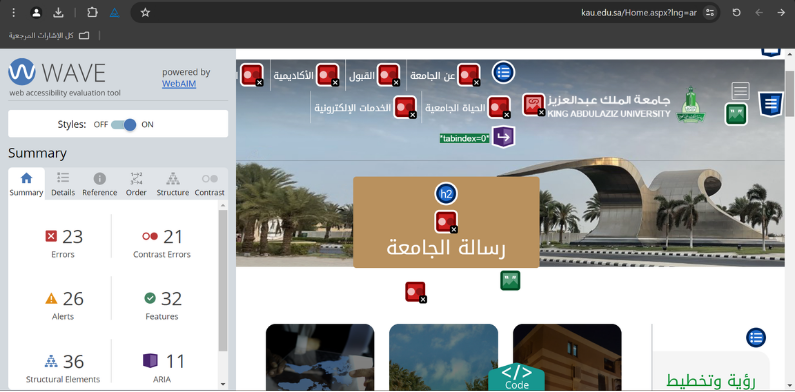
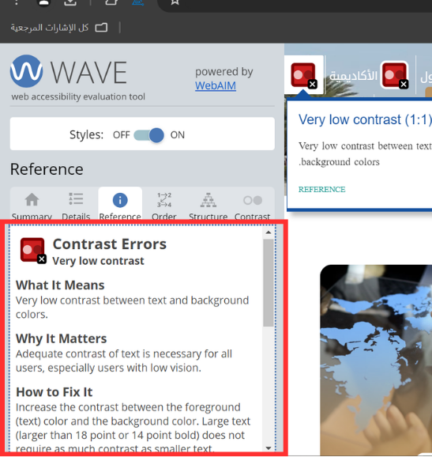
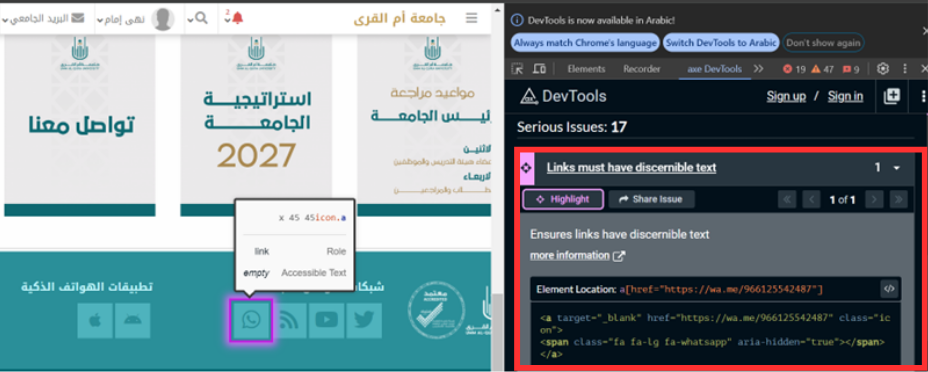
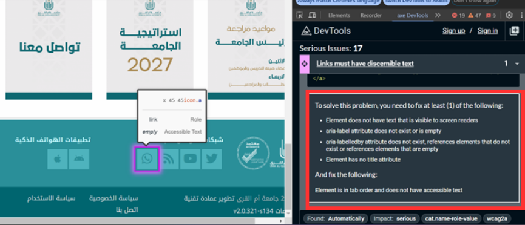

# Web Accessibility Testing

A web accessibility testing project focused on identifying and documenting accessibility issues in web pages using WAVE and axe DevTools.

## Tools Used

- WAVE Web Accessibility Evaluation Tool
- axe DevTools
- Google Chrome

## 1. WAVE Accessibility Testing

The WAVE Web Accessibility Evaluation Tool was used to evaluate a web page and identify potential accessibility barriers by analyzing its structure, content, and interactive elements.

### Tested Website

**King Abdulaziz University Website**

### Accessibility Issues Identified

- Very low color contrast
- Missing alternative text
- Missing form labels

The identified issues were reviewed to understand the problem, its impact, and the available information for remediation.

### WAVE Results

### Example: Very Low Color Contrast

## 2. axe DevTools Accessibility Testing

axe DevTools was used as an additional accessibility testing tool to scan web pages and examine their structure, elements, and attributes.

### Tested Website

**Umm Al-Qura University Website**

### Accessibility Issues Identified

- Elements must meet minimum color contrast ratio thresholds
- Links must have discernible text
- Elements must only use supported ARIA attributes

The detected issues were reviewed using the information provided by axe DevTools, including the affected element, problem description, and suggested solution.

### Example: Links Must Have Discernible Text

## What I Practiced

- Web accessibility testing
- Identifying accessibility issues
- Reviewing affected HTML elements
- Understanding accessibility error descriptions
- Documenting identified issues and suggested solutions
- Using WAVE and axe DevTools for accessibility evaluation
